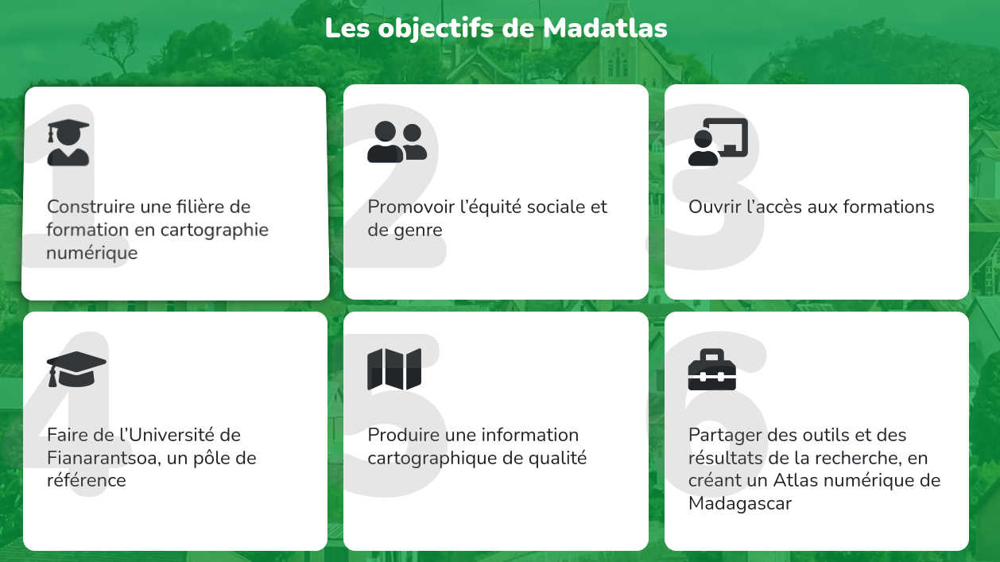

# MadAtlas

> MadAtlas est un projet universitaire financé par l'AFD. Il regroupe en France les universités de Gustave Eiffel et de Bordeaux-Montaigne et à Madagascar l'Université de Fianarantsoa. Ce projet vise à mettre en place une filière de cartographie LMD (Licence, Master, Doctorat). Dans ce contexte, des modules de sensibilisation à OpenStreetMap ont été mis en place au sein de la licence professionnelle Cartographie Numérique et Aménagement Durable, du master Ingénierie Géo spatiale et Technologie de l'Information et des doctorants. Cela a été également l’occasion en 2024 de co-organiser le premier State of the Map Madagasikara 2024.

# Qui je suis ?

Vincent Bergeot (Vinber | VinberPro)

- Directeur général de [Teritorio](https://www.teritorio.fr/)
- Entrepreneur salarié de [Coop'Alpha](https://www.coopalpha.coop/) (Coopérative d'Activités et d'emplois)
  - certification Qualiopi pour la formation professionnelle *[Contribuer à OpenStreetMap](https://www.coopalpha-formation.fr/formation/contribuer-a-openstreetmap/)*,
- Chercheur associé de l'[UMR Passages](https://www.passages.cnrs.fr/)
- Adhérent et bénévole OpenStreetMap France

# Teritorio

- structure commerciale de l'ESS,
- 5 personnes salariées, autant de partenaires avec qui on travaille régulièrement

## Que fait-on :

- éditeur logiciel
       - Conception **De la donnée à la carte web avec la stack CartoGuide : Ontologie de POI OSM + Clearance + Datasources + Elasa + Vido** je vous laisse aller voir la présentation de Frédéric Rodrigo hier
       - Participation à des projets
           - **MapLibre GL Teritorio Cluster** présenté hier par Noé Viricel 
           - **GoGoCarto** -> financement de fonctionnalités, résolution de bugs, déploiement en cours d'une instance GoGoCartoPro des présentations ont eu lieu les années précédentes avec [Carteco](https://carteco-ess.org/), GoGoCarto, ...
- formation, accompagnement, conduite de projets
    - Tourisme et des collectivités,
           - [Bande annonce du film - documentaire -promotion sortie la semaine dernière](https://video.teritorio.fr/w/s2gZUGXPUFQFRQrVVKizxt),
    - Universités
        - GTNum DEFI, https://hal.science/hal-04904934v1/document
        - MadAtlas, c'était ce matin **MadAtlas, 2 ans d'initiation à OpenStreetMap à l'université de Fianarantsoa**
        - MapCampus, pas à jour du tout https://wiki.openstreetmap.org/wiki/FR:MapCampus @Marina au secours :)

> https://carte.teritorio.fr/

Teritorio est prestataire de l'UBO dans le cadre de ce projet Tous EGO pour de l'accompagnement, du conseil et des ateliers, animations, formations, cartoparties ... On en parle ensuite

# Objectifs MadAtlas

- Construire une filière de formation en cartographie numérique
- Pomouvoir l'équité sociale et de genre
- ouvrir l'accès aux formations
- Faire de l'Université de Fianrantsoa un pôle de référence
- Produire une information cartographique de qualité
- Partager des outils et des résultats de la recherche, en créant un Atlas numérique de Madagascar

# OpenStreetMap à Madagascar

De mon petit bout de lorgnette

- depuis des années (pensée à Cart'ONG et à Violaine Doutreleau, à la coopération avec la région Nouvelle Aquitaine et la région Itasy)
    - plusieurs "mapathons"
        - entre des étudiants d'IFAID (Pessac), plusieurs ONG à Madagascar, des étudiants et membres de la communauté OSM-MG
            - une association OpenStreetMap Madagascar depuis 2016 !
        - entre des étudiants de l'Université Bordeaux Montaigne et l'université de Diégo dans le cadre de coopération universitaire,

# OpenStreetMap à Madagascar

[Des projets divers](https://wiki.openstreetmap.org/wiki/FR:WikiProject_Madagascar#Activit%C3%A9s_/_Projets)

Exemple du projet de l'[ONG Pivot](https://www.pivotworks.org/) -> [wiki](https://wiki.openstreetmap.org/wiki/Organised_Editing/Activities/Malaria_Remote_Populations_-_Mapping_in_South_Eastern_Madagascar)

Vous avez Christophe Révillon qui présente cela à 13h30 salle A001 Contribution à grande échelle sur OpenStreetMap pour améliorer l'accessibilité aux soins dans le Sud-Est de Madagascar. Et vous pouvez le voir aussi sur le peertube de l'association OSM-fr et la chaîne du State of the Map Magagasikara 2024 !

Avec un travail pour faire une estimation sur l'extension à l'ensemble de Madagascar

# OpenStreetMap et MadAtlas, dès 2022 à Nantes

- 2022, regroupement à Nantes pour avancer sur le projet MadAtlas (UGE, UBM, UF)
    - hasard du calendrier, je leur propose de passer au State of the Map à Nantes
    - la délégation franco-malgache passe pour voir comment cela se déroule
    - sans doute à ce moment que l'idée d'un State of the Map Mada émerge

# 2023

en distanciel

- avril, quelques visios, cours, sensibilisations avec des encadrants, doctorants, master autour d'OpenStreetMap
    - je commence à m'interroger sur les conditions de ravail à l'UF
- juin-juillet 2023, 4 sessions (3h environ) de cours avec les L3Pro,
    - 4 thématiques (commerces, écoles, transports, santé),
    - Les étudiants sont agréablement surpris de trouver les pages wiki spécifiques à Madagascar,
    - mais complexe -> je ne vois pas les étudiants, wifi aléatoire, coupure d'électricité
- juin 2023 une délégation malgache (4 professeurs de l'UF) vient à l'UMR Passages à Bordeaux,
    - 2 jours pour parler cartographie OSM et découvrir alors mapillary
- août 2023, cette délégation malgache organise une cartopartie à Fianarantsoa,

Le distanciel est vraiment complexe, les conditions matérielles pour les étudiants sont difficiles (ordinateurs, internet, électricité et la langue). Je doute vraiment de la pertinence de ce que je fais !

A permis de faire du lien avec des membres de la communauté malgache, d'échanger sur talk-mg.

- octobre 2023, en même temps que la décision de l'université d'été, suite à des contacts avec plusieurs personnes d'OSM-MG, décision d'organiser un State of the map Madagasikara dans la continuité de l'université d'été

# Préparation du SotM-MG

- Le mail n'est pas autant dans les habitudes, toutes les adresses sont du gmail (universitaires, étudiants, ...),
- les forfaits les moins coûteux sont ceux permettant d'avoir accès à WhatsApp ou Facebook,
- choix à faire, whatsApp ou pas d'orga pour moi ! j'ai choisi WhatsApp ... 

# En route pour Fianarantsoa

400 km au sud de Tana, environ 12 h de taxi, une des routes les plus importantes de Madagascar

Première fois pour moi à Madagascar (merci Anouk pour l'accueil et l'accompagnement des premiers jours).

3 semaines en présentiel

    - 1 semaine de cours avec la deuxième promo de L3Pro
        - je réalise à quelques points l'année d'avant, cela a du être complexe pour eux,
        - nous mettons en place des temps pour permettre la traduction en malgache,
        - d'autant plus impressionné par la participation qu'il y a pu avoir l'année d'avant,
    - Des cours avec les Master également
        - intervention d'Antoine Riche de CartoCité autour d'overpass et de Frédéric Rodrigo sur les tuiles vectorielles

Dans le cadre de MadAtlas, du matériel (ordinateurs, ordinateurs portables, serveurs, bornes wifi) est prévu. Une partie est arrivée.
La connexion internet s'est améliorée mais toujours des coupures d'électricité. Cela se gère mieux quand nous sommes dans la même pièce.

Initiation iD, JOSM, OsmAnd, overpass

- OsmAnd est le coup de coeur pour les étudiants, un gps hors ligne, tout Madagascar sur son téléphone (téléchargement en amont)
- Clé avec JOSM pour éviter que tout le monde le télécharge.

> anecdote
> Surtout ne pas utiliser google maps pour cartographier dans OSM ! Encore faut-il que GoogleMaps soit utilisé ... et donc non le monde entier n'utilise pas GoogleMaps et le monde entier ne considère pas que c'est la réponse à tout !

# 2024 Université d'été

- la cérémonie d'ouverture de l'université d'été de MatAtlas regroupe ministres, députés, ambassadeur de France à Madagascar, ...
    - je suis "spectateur" et réalise alors vraiment les enjeux pour l'université de Fianarantsoa et pour Madagascar,
        - signature de la première charte de genre à Madagascar par exemple !
- [université d'été, le programme](https://www.madatlas.mg/ProgrammeUnivEte_SOTM2024.pdf)

# 2024 State of the Map Madagasikara

Belle réussite, 1 centaine de personnes, reportage https://peertube.openstreetmap.fr/w/kpw6XNWxko8ybremW4cTar

5 jours de trajets pour venir pour certaines personnes !

# 2025 mixte présentiel et distanciel

## L3 pro

- depuis janvier 2025
    - contact régulier avec plusieurs collègues malgaches,
    - février-mars 2 semaines de travaux en communs à Fianarantsoa,
        - sur les contenus, la trame des cours, le syllabus !
        - je refuse de faire les cours pour les L3Pro
        - ceux sont 2 doctorants qui se jettent à l'eau et assurent les cours autour d'OpenStreetMap.
        - nous avons des réunions hebdomadaire de suivi et échange.

Et c'est clairement ce qui semble fonctionner le mieux !

- quelques résultats
    - la dernière promo (début en mars), c'est autour de 1000 changesets
    - chaque promo a un "chantier-école" qui diffère chaque année
        - c'est l'occasion tout au long de la promotion d'aller mener des enquêtes sur le terrain, en partenariats avec les autorités locales
        - les 2 premières années, le lien avec OSM pour les chantiers écoles n'a pas vraiment fonctionné,
    - cette année, OSM a pu vraiment être positionné au début de la formation et donc depuis début  mai, quand on a su le terrain du chantier école, on a pu préparer :
    - Commune de Iarintsena
        - un tasking mis en place par une université au Cambodge (merci géomechain !), https://tasks.geohealthresearch.org/projects/47
        - environ 200 highway https://overpass-turbo.eu/s/25O5 début 2025
            - plus de 1700 cette semaine https://overpass-turbo.eu/s/25O6
        - plus de 1500 highway de plus
        - Osmose chauffe https://osmose.openstreetmap.fr/fr/map/#loc=10/-21.7522/46.7758&item=1210&level=1
            - c'est en cours, une repasse des étudiants sur les catégories de voies, les connections,
            - une repasse va aussi se faire sur les waterways,

Les étudiants vont pouvoir aller sur le terrain avec une base et donc avancer sur les POI type école, mairie, ...

Les autres enseignants de la licence Pro s'intéressent de plus en plus à la donnée OSM, une des rares données disponible pour la commune !

## Master

- contribution à OSM et utilisation d'overpass, quickOSM et uMap avec les importateurs !
    - Un moyen simple et rapide de monter, montrer des cartes numériques, en ligne, partageable, accessible.

Les projets de groupe autour d'OSM sont moins présents dans la maquette du master, en cours de réflexion cependant !

J'ai cependant eu l'occasion d'échanger avec certains étudiants de master 2 (initiés à OSM les années précédentes) et plusieurs ont intégré (sous la direction de leurs enseignants) l'usage des données OpenStreetMap dans leurs travaux (application de mobilité, étude sur la résilience de certains territoire, validation de certains modèles de reconnaissances de photos aériennes, ...). Cela infuse donc !

# Perspectives !

## pour les formations

- continuer l'initiation à la contribution OpenStreetMap, dès le démarrage de la formation,
- intégrer davantage OSM lors des chantiers écoles lors des enquêtes menées par les étudiants,
- pousser davantage l'usage de uMap pour la réalisation de cartographie numérique,
- réfléchir à des services et des modèles économiques pour les futurs professionnels,

## du matériel (serveurs) arrive à l'université de Fianarantsoa

Dans les "envies" :

- geodatamine
- umap
- ... 

## communauté

- State of the Map Madagasikara 2 ? en 2026 ?
- State of the Map Monde 2026 à Paris ?

# Impacts colatéraux

- acculturation de collègues des universités UBM et UGE (pensées toutes particulières à Sophie Moreau coordo MadAtlas et  Olivier Pissoat de l'UMR Passages
- échanges et discussions avec beaucoup de monde,

<link rel="stylesheet" type="text/css" href="index.css">